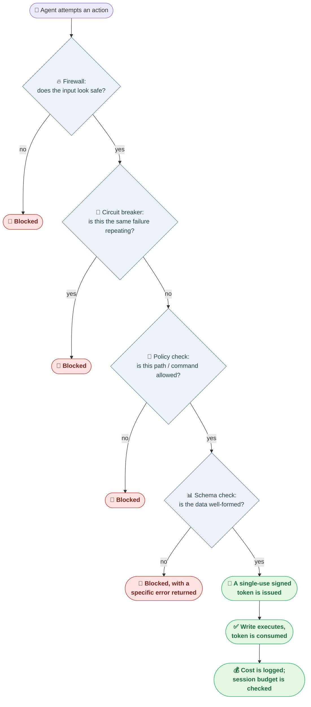

# 🛡️ Agent OS

<p align="center">
  <a href="https://github.com/WhitWei/agent-os-oss/actions"></a>
  <a href="LICENSE"></a>
  <a href="https://www.python.org/"></a>
  <a href="https://github.com/WhitWei/agent-os-oss/releases"></a>
  <a href="docs/handbook.md"></a>
</p>

<p align="center">
  <b>A self-hosted governance runtime that sits between your LLM agents and the systems they can touch.</b>
</p>

<p align="center">
  <a href="README.zh-CN.md">🇨🇳 简体中文</a>
</p>

<!--
  TODO before public launch: replace this line with a real ~30s terminal recording GIF
  showing `agentos write` being blocked without a valid nonce, then succeeding with one.
-->

---

## 💡 What is Agent OS?

Giving an LLM agent raw access to a shell, a filesystem, or a database is a bit like handing a new employee the master key on day one. Most of the time it's fine — until a bad prompt, a buggy retry loop, or a malformed instruction turns "fine" into a deleted table, a leaked secret, or a runaway bill.

**Agent OS** is a small, self-hosted runtime that stands between your agent and everything it's allowed to touch. Every tool call, every write, every retry passes through it first — checked, rate-limited, and cryptographically signed — instead of just trusting the model to behave.

It is **not** a full agent framework like LangChain, and it's **not** a coding-agent product like OpenHands. Think of it as the seatbelt, not the car: you'd put it *underneath* whatever agent framework you're already using.

---

## ⚖️ Why Agent OS?

| Security capability | Typical agent SDK (LangChain, LlamaIndex, etc.) | With Agent OS |
| :--- | :--- | :--- |
| **Filesystem access** | No real boundary — the agent can touch whatever path it's given | Locked to an explicit allowlist of paths |
| **Shell commands** | Arbitrary `exec`/`system` calls | Commands must match an allowlist; arguments are sanitized |
| **Prompt injection** | No built-in defense | A lightweight firewall scans untrusted input before it reaches a tool |
| **Runaway loops & cost** | Nothing stops a retry loop from burning your API budget | A circuit breaker catches repeated failures; a hard spending cap stops the session |
| **Database writes** | The agent can emit raw Cypher/SQL directly | Every write must pass schema validation, then carry a single-use signed token |

Compared to heavier guardrail stacks (e.g. NeMo Guardrails), Agent OS deliberately stays minimal: no extra model call in the safety path, sub-millisecond checks instead of a second inference round-trip, and a small enough codebase that you can actually read all of it in one sitting.

---

## 🔌 Use it as an MCP Server (Claude Desktop)

Agent OS can run as a **Model Context Protocol (MCP)** server, acting as a governance gateway in front of Claude Desktop or any other MCP-compatible client.

### 3-line setup

Add this to your `claude_desktop_config.json`:

```json
{
  "mcpServers": {
    "agent-os": {
      "command": "aos",
      "args": ["start-mcp", "--port", "8100"]
    }
  }
}
```

From now on, every write your Claude Desktop agent attempts goes through Agent OS's firewall and write gate first.

---

## 🚀 Quick Start

### 1. Install (in a virtual environment)

> On Debian/Ubuntu-based systems with a system-managed Python (PEP 668), installing straight into the system interpreter can conflict with OS-managed packages. We recommend a venv even for a quick trial.

```bash
git clone https://github.com/WhitWei/agent-os-oss.git
cd agent-os-oss
python3 -m venv .venv && source .venv/bin/activate
pip install -e ".[dev]"
```

### 2. Verify the safety mechanisms (no Docker needed)

This runs the full unit-test suite — WriteGate nonce logic, schema validation, the WASM sandbox, the firewall — including tests that specifically try to bypass each one:

```bash
aos init            # generates a default policy_config.yaml
pytest tests/ -v -m "not integration"
```

### 3. (Optional) Full integration + end-to-end suite with a real database

Requires Docker:

```bash
docker compose -f docker/docker-compose.yml up -d
export RYUK_DISABLED=true
pytest tests/ -v
```

### 4. Run the interactive demo

```bash
python3 scripts/run_demo.py
```

---

## 🏗️ How a Request Actually Flows Through Agent OS

Every action an agent tries to take — a tool call, a file write, a database write — walks through the same sequence of checkpoints. Any checkpoint can stop it; nothing reaches the database without passing all of them.



A few things worth calling out about this design:

- **Every gate fails closed.** If a check can't be completed, the default is "block," not "allow."
- **The signed token is single-use.** Once it's spent on a write, replaying it a second time is rejected — this is what stops an agent (or an attacker) from reusing a valid-looking request.
- **The schema check happens before the token is issued**, not after — malformed data never gets far enough to touch the database.

---

## 🛡️ Three-Tier Testing Standard

We hold every change to three tiers of testing, specifically to avoid "phantom merges" — code where each module passes its own tests but the pieces silently don't work together:

1. **L1 · Unit tests** — fully mocked, verifies logic in isolation. Fast, no external dependencies.
2. **L2 · Integration tests** — no mocking of core security components. Spins up a real database via `testcontainers` and checks what's actually stored, not what the code claims happened.
3. **L3 · End-to-end tests** — zero mocking, a full simulated business flow (e.g. an employee-onboarding approval process) run start to finish.

See [CONTRIBUTING.md](CONTRIBUTING.md) for the full workflow and how to run each tier locally.

---

## 🤝 Contributing & Community

This is currently a one-person project — response times on issues and PRs will vary, but every one gets read. If you're curious about the design decisions behind the write gate or the schema-validation model, opening a discussion is the fastest way into that conversation.

- Read [CONTRIBUTING.md](CONTRIBUTING.md) before opening a PR — the testing standard above is enforced, not optional.
- Found a bug? [Open an issue](https://github.com/WhitWei/agent-os-oss/issues) — adversarial / red-team reports are especially welcome given what this project is trying to do.
- See [CODE_OF_CONDUCT.md](CODE_OF_CONDUCT.md) for community guidelines.

---

## 📄 License

Distributed under the MIT License. See [LICENSE](LICENSE) for details.
