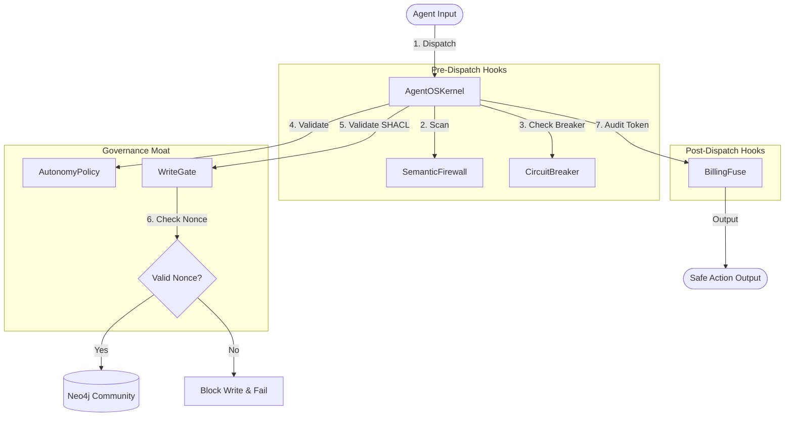

# 🛡️ Agent OS

<p align="center">
  <a href="https://github.com/your-username/agent-os-oss/actions"></a>
  <a href="LICENSE"></a>
  <a href="https://www.python.org/"></a>
  <a href="docs/handbook.md"></a>
</p>

<p align="center">
  <b>A secure, self-healing, and strictly governed runtime environment for LLM Agents.</b>
</p>

<p align="center">
  <a href="README.zh-CN.md">🇨🇳 简体中文 (Chinese README)</a>
</p>

---

## 💡 What is Agent OS?

LLM Agents are powerful, but giving them raw access to shell commands, filesystems, and databases invites disaster (e.g., prompt injection leading to file loss, looping code execution causing token overspend).

**Agent OS** is a lightweight, low-level runtime safety and governance framework that serves as a **"Security Moat"** between LLM agents and physical operating systems / databases. It intercepts, sanitizes, and cryptographic-governs all agent inputs, system executions, and data writes.

---

## ⚖️ Why Agent OS?

| Security Features | Raw Agent SDK (e.g. LangChain, LlamaIndex) | Agent OS Runtime |
| :--- | :--- | :--- |
| **Filesystem Safety** | ❌ None (raw path manipulation allowed) | ✅ Strict sandbox directory restrictions (`allowed_paths`) |
| **Command Execution** | ❌ Run any command (exec / system) | ✅ Rigid whitelist control & shell argument sanitization |
| **Prompt Injection** | ❌ Vulnerable to prompt jailbreaks | ✅ Run-time **SemanticFirewall** input sanitization |
| **Runaway Breaker** | ❌ Infinite loops leading to high API bill | ✅ **BillingFuse** spending quotas & **CircuitBreaker** logic |
| **Database Writes** | ❌ Raw Cypher/SQL queries execution | ✅ Cryptographic **WriteGate** 3-stage validation + SHACL |

---

## 🏗️ Architecture & Control Flow

Agent OS integrates safety hooks directly into the kernel dispatch cycle:



---

## 🚀 Quick Start (Local Development)

### 1. Spin up Safe Storage (Neo4j & Langfuse)
We provide a pre-configured community Docker stack:
```bash
docker compose -f docker/docker-compose.yml up -d
```

### 2. Install Dependencies
```bash
pip install -e ".[dev]"
```

### 3. Run the E2E Integration Verification
Test the entire safety cycle (firewall, billing fuse, and database write checks) in one go:
```bash
export RYUK_DISABLED=true
python3 -m pytest tests/ -v
```

### 4. Execute the Demo Script
Observe the runtime in action:
```bash
python3 scripts/run_demo.py
```

---

## 🛡️ Three-Tier Testing Constitution

We enforce a strict quality gate in our development workflow:
1.  **L1 Unit Tests**: No external dependencies. Run logic check.
2.  **L2 Integration Tests**: Uses `testcontainers` to launch actual Neo4j instances to check actual transactional batch writes.
3.  **L3 E2E Tests**: Simulates full user flow (e.g. employee onboarding SOP card approvals).

Please read our [Contributing Guide](CONTRIBUTING.md) for more details.

---

## 📄 License

Distributed under the MIT License. See [LICENSE](LICENSE) for more information.
