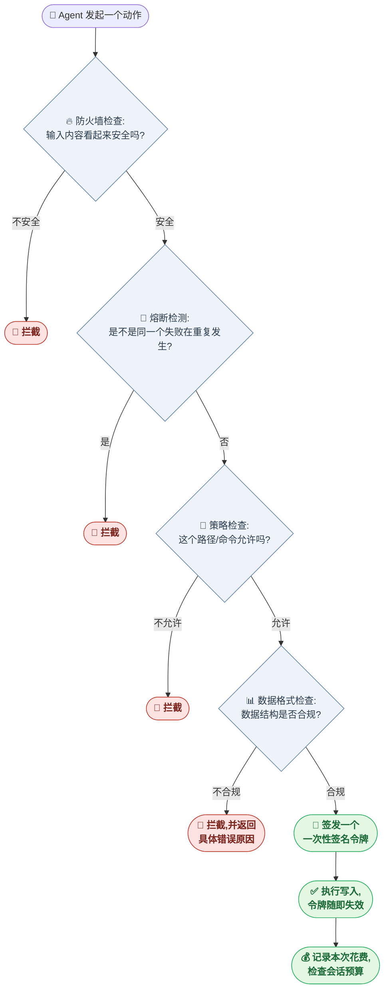

# 🛡️ Agent OS

<p align="center">
  <a href="https://github.com/WhitWei/agent-os-oss/actions"></a>
  <a href="LICENSE"></a>
  <a href="https://www.python.org/"></a>
  <a href="https://github.com/WhitWei/agent-os-oss/releases"></a>
  <a href="docs/平台介绍与操作手册.md"></a>
</p>

<p align="center">
  <b>一个自托管的治理运行时,架在你的LLM Agent和它能碰到的一切系统之间。</b>
</p>

<p align="center">
  <a href="README.md">🇺🇸 English README</a>
</p>

<!--
  发布前TODO:把这一行换成一段约30秒的真实终端录屏GIF,
  展示 `agentos write` 在没有合法令牌时被拦截、拿到令牌后又能成功执行的完整过程。
-->

---

## 💡 Agent OS 是什么?

给LLM Agent开放shell命令、文件系统或数据库的原始访问权限,有点像新员工第一天上班就给了他一把万能钥匙——大多数时候没事,直到某一次错误的提示词、一个失控的重试循环,或者一条格式错误的指令,把"没事"变成一张被删掉的表、一个泄露的密钥,或者一笔停不下来的账单。

**Agent OS** 是一个小巧的、可自托管的运行时,架在你的Agent和它被允许碰到的一切系统之间。每一次工具调用、每一次写入、每一次重试,都要先经过它——校验、限流、加密签名——而不是简单地指望大模型"应该会守规矩"。

它**不是**一个完整的Agent框架(不像LangChain那样),也**不是**一个编码Agent产品(不像OpenHands那样)。可以把它理解成安全带,而不是车本身——你会把它装在你已经在用的那套Agent框架**下面**。

---

## ⚖️ 为什么需要 Agent OS?

| 安全能力 | 常见Agent SDK(LangChain、LlamaIndex等) | 有了 Agent OS |
| :--- | :--- | :--- |
| **文件系统访问** | 没有真正的边界,给什么路径Agent就能碰什么路径 | 严格限定在明确声明的路径白名单内 |
| **Shell命令执行** | 可任意调用`exec`/`system` | 命令必须匹配白名单,参数会被净化 |
| **提示词注入** | 没有内建防御 | 一层轻量防火墙会在指令到达工具之前扫描不可信输入 |
| **失控循环与超支** | 没有任何机制能阻止重试循环烧光API预算 | 熔断器会抓住重复出现的失败,硬性费用上限会直接叫停整个会话 |
| **数据库写入** | Agent可以直接生成原始的Cypher/SQL语句 | 每一次写入都必须先通过数据格式校验,再携带一个一次性签名令牌 |

和更重的护栏方案(比如NeMo Guardrails)相比,Agent OS刻意保持极简:安全检查这条路径上不会额外多调用一次模型,用亚毫秒级的检查代替再走一轮推理,代码量也控制在"一口气就能读完"的规模。

---

## 🔌 作为 MCP Server 使用(接入 Claude Desktop)

Agent OS可以作为**Model Context Protocol(MCP)**服务运行,在Claude Desktop或任何兼容MCP的客户端前面充当治理网关。

### 三行配置搞定接入

在你的`claude_desktop_config.json`里加上:

```json
{
  "mcpServers": {
    "agent-os": {
      "command": "aos",
      "args": ["start-mcp", "--port", "8100"]
    }
  }
}
```

从此你的Claude Desktop Agent发起的每一次写操作,都会先经过Agent OS的防火墙和写入网关。

---

## 🚀 快速开始

### 1. 安装(建议使用虚拟环境)

> 在Debian/Ubuntu这类系统Python受管理(PEP 668)的环境下,直接装进系统解释器可能会和系统自带的包冲突。哪怕只是想快速试用一下,也建议用虚拟环境。

```bash
git clone https://github.com/WhitWei/agent-os-oss.git
cd agent-os-oss
python3 -m venv .venv && source .venv/bin/activate
pip install -e ".[dev]"
```

### 2. 验证核心安全机制(不需要Docker)

这会跑通全部单元测试——写入令牌逻辑、数据格式校验、WASM沙箱、防火墙——包括专门试图绕过每一项机制的测试:

```bash
aos init            # 生成默认的 policy_config.yaml
pytest tests/ -v -m "not integration"
```

### 3.(可选)带真实数据库的完整集成与端到端测试

需要本地Docker:

```bash
docker compose -f docker/docker-compose.yml up -d
export RYUK_DISABLED=true
pytest tests/ -v
```

### 4. 运行交互式演示

```bash
python3 scripts/run_demo.py
```

---

## 🏗️ 一次请求在 Agent OS 里到底经历了什么

Agent想做的任何一个动作——一次工具调用、一次文件写入、一次数据库写入——都会走过同一串检查点。任何一关都可能拦下它;没有全部通过,就到不了数据库。



这套设计里有几个值得注意的细节:

- **每一关的默认行为都是"拒绝"而不是"放行"。** 如果某项检查因为任何原因没能顺利完成,系统的默认反应是拦截,而不是"先放过去再说"。
- **签名令牌只能用一次。** 一旦被某次写入消费掉,同一个令牌再被拿来用第二次会被直接拒绝——这正是防止Agent(或攻击者)重放一个"看起来合法"的请求的关键。
- **数据格式检查发生在令牌签发之前,而不是之后。** 不合规的数据根本走不到能碰数据库的那一步。

---

## 🛡️ 强制三层测试标准

每一次改动都要经过三层测试,目的是专门避免"幽灵式合并"——每个模块自己的测试都通过,但拼在一起之后悄悄地根本没跑通:

1. **L1 · 单元测试** —— 全部Mock,只验证独立逻辑,速度快、无外部依赖。
2. **L2 · 集成测试** —— 不允许Mock核心安全组件。用`testcontainers`拉起真实数据库,检查实际存下来的数据,而不是代码自己声称发生了什么。
3. **L3 · 端到端测试** —— 零Mock,完整模拟一个真实业务流程(比如一条员工入职审批流程)从头走到尾。

完整工作流程和每一层的具体跑法,见[CONTRIBUTING.md](CONTRIBUTING.md)。

---

## 🤝 贡献与社区

这目前是一个单人维护的项目——issue和PR的响应时间会有波动,但每一条都会被认真看。如果你对写入网关或者数据格式校验模型背后的设计决策感兴趣,开一个discussion是最快能聊起来的方式。

- 提PR之前请先读[CONTRIBUTING.md](CONTRIBUTING.md)——上面的三层测试标准是强制要求,不是建议。
- 发现bug?[提一个issue](https://github.com/WhitWei/agent-os-oss/issues)——考虑到这个项目本身的定位,对抗性/红队式的问题报告尤其欢迎。
- 社区行为规范见[CODE_OF_CONDUCT.md](CODE_OF_CONDUCT.md)。

---

## 📄 授权协议

本项目采用MIT开源授权协议。详情见[LICENSE](LICENSE)。
