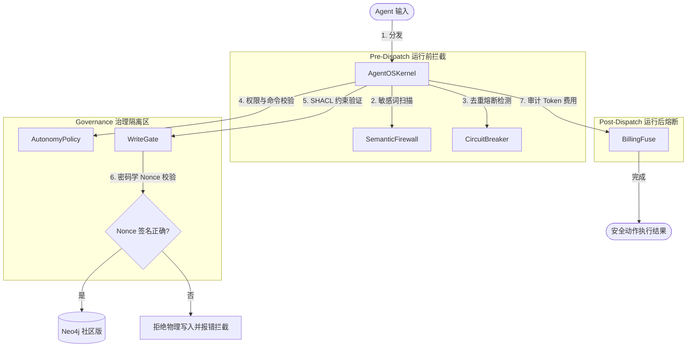

# 🛡️ Agent OS

<p align="center">
  <a href="https://github.com/your-username/agent-os-oss/actions"></a>
  <a href="LICENSE"></a>
  <a href="https://www.python.org/"></a>
  <a href="docs/平台介绍与操作手册.md"></a>
</p>

<p align="center">
  <b>面向大语言模型智能体（LLM Agent）的安全、可自愈与强治理运行时环境。</b>
</p>

<p align="center">
  <a href="README.md">🇺🇸 English README</a>
</p>

---

## 💡 什么是 Agent OS？

大语言模型 Agent 能力强大，但赋予它们直接的 shell 命令行、物理文件系统和数据库读写权限极具安全隐患（例如：提示词注入导致本地重要文件丢失，或者陷入代码执行死循环烧光大模型 Token 预算）。

**Agent OS** 是一个轻量级、底座级的运行时安全与权限治理框架。它在大模型 Agent 与物理操作系统/数据库之间充当**“安全护城河”**，对 Agent 输入、指令执行和数据写入进行全方位的拦截、清洗和基于密码学 Nonce 的强治理拦截。

---

## ⚖️ 核心优势对比

| 安全与治理特性 | 原生 Agent SDK (如 LangChain / LlamaIndex) | Agent OS 运行时防御机制 |
| :--- | :--- | :--- |
| **文件系统防护** | ❌ 零防护（允许 Agent 任意越界读写） | ✅ 严格的文件目录沙箱控制 (`allowed_paths`) |
| **外部指令执行** | ❌ 直接调用 eval/system 跑任意指令 | ✅ 强硬的指令白名单控制与 shell 参数动态净化 |
| **提示词防注入** | ❌ 极易受到提示词越狱/越权攻击 | ✅ 运行时 **SemanticFirewall** 敏感词过滤拦截 |
| **失控熔断保护** | ❌ 代理死循环直至耗尽企业 Token 预算 | ✅ **BillingFuse** 消费硬熔断与 **CircuitBreaker** 去重熔断 |
| **数据库物理写入** | ❌ 大模型直接执行任意 Cypher/SQL 写入 | ✅ 密码学 **WriteGate** 三段式 SHACL 规范与 Nonce 授权写入 |

---

## 🏗️ 架构与控制流

Agent OS 将安全与遥测拦截钩子优雅地织入了内核调度的完整生命周期中：



---

## 🚀 快速启动（本地开发环境）

### 1. 启动安全存储组件 (Neo4j 与 Langfuse)
我们已为您备好一键拉起社区开源版存储栈的 compose 脚本：
```bash
docker compose -f docker/docker-compose.yml up -d
```

### 2. 安装项目依赖
```bash
pip install -e ".[dev]"
```

### 3. 运行全量集成测试
一键验证防火墙拦截、重复熔断以及真实 Neo4j 数据库持久化批写入是否正常运行（请确保本地 Docker 守护进程已启动）：
```bash
export RYUK_DISABLED=true
python3 -m pytest tests/ -v
```

### 4. 运行演示 Demo
在终端观察运行时内核对正常/恶意请求的过滤与阻断逻辑：
```bash
python3 scripts/run_demo.py
```

---

## 🛡️ 强制三层测试防御体系

我们拒绝“摆拍式”单测，任何合流 PR 必须严格通过三层质量门禁：
1.  **L1 单元测试**：全 Mock，验证单个方法逻辑。
2.  **L2 集成接线测试**：不 Mock 内部核心防火墙。使用 `testcontainers` 真实拉起 Neo4j 进行落库和 OTel 遥测比对。
3.  **L3 E2E 冒烟测试**：100% 真实部署，走完员工入职 SOP 卡片流转。

详情请参考 [开源贡献指南 (CONTRIBUTING.md)](CONTRIBUTING.md)。

---

## 📄 授权协议

本项目采用 MIT 开源授权协议。详情请参阅 [LICENSE](LICENSE)。
